# EventFinder South Africa

[](https://github.com/Zulfique/eventfinder-south-africa/actions/workflows/android-ci.yml)


A native **Android (Kotlin + Jetpack Compose)** app that helps people across South Africa
discover, save and create local events — from Joburg jazz nights to Cape Town food markets
and Durban festivals.

EventFinder was built as the **Part 2 (final) Portfolio of Evidence** for the module.
It consumes **100% free, keyless-or-free-tier REST APIs**, requires **no paid infrastructure**,
and runs on a physical device or emulator.

---

## Table of contents

1. [Features](#features)
2. [Screenshots](#screenshots)
3. [Tech stack](#tech-stack)
4. [Architecture](#architecture)
5. [External APIs](#external-apis)
6. [Localisation](#localisation)
7. [Offline-first behaviour](#offline-first-behaviour)
8. [Security](#security)
9. [Getting started](#getting-started)
10. [Testing](#testing)
11. [Continuous integration](#continuous-integration)
12. [Project structure](#project-structure)
13. [Requirement traceability](#requirement-traceability)
14. [Attribution & licences](#attribution--licences)

---

## Features

| Area | What it does |
| --- | --- |
| **Discover** | Browse the national event directory, filter by category chip and free-text keyword, sort by date / distance / name. |
| **Near me** | Requests location permission and sorts events by distance using the Haversine great-circle formula. |
| **Map** | Event locations plotted on a free OpenStreetMap map (osmdroid) — no Google Maps key or billing. |
| **Event detail** | Hero image, organiser, attendee count, venue map link, **weather forecast at the venue** on the event day, share and RSVP. |
| **Search** | Debounced keyword search with recent-search history and popular events. |
| **Create event** | A 3-step wizard (details → date/time → location) with an optional photo picked from the system photo picker. |
| **My events** | Organisers can edit or delete the events they created from the detail screen's overflow menu. |
| **Favourites** | Save events offline; favourites survive app restarts and are queued for sync. |
| **Profile** | Account header, activity stats (created / attending / favourites), My Events and Attending lists. |
| **Edit profile** | Update display name and email with validation. |
| **Settings** | Language switch (English / Afrikaans), biometric login toggle, event reminders, new-event alerts, plus account tools (change password, clear local cache, delete account). |
| **Auth** | Local email + password registration and login (PBKDF2-hashed), plus biometric unlock. Forgot password re-hashes a new password on-device (the free prototype sends no email). |
| **Reminders** | `AlarmManager` + `NotificationChannel` reminders **24 hours and 1 hour** before an attended event, cancelled when the RSVP is declined. |
| **Event alerts** | After each background sync, on-device notifications flag brand-new future events and changes to favourited events — computed by a pure diff, no push service required. |

## Screenshots

Every screen below was captured from the running app on an Android 14 (API 34)
emulator at 1080 × 2340.

| Login | Register | Forgot password | Home (Discover) |
| :---: | :---: | :---: | :---: |
| 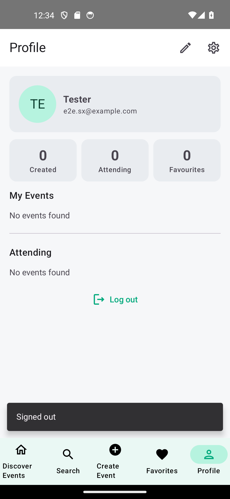 | 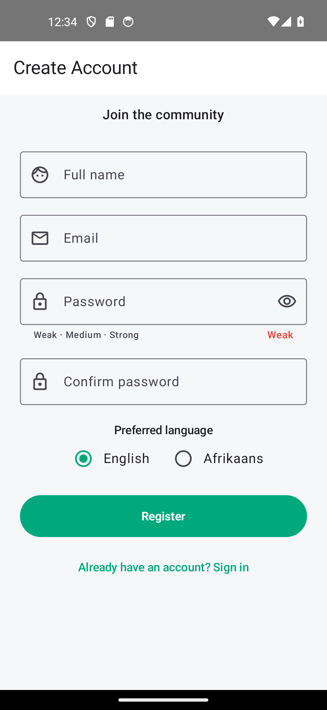 | 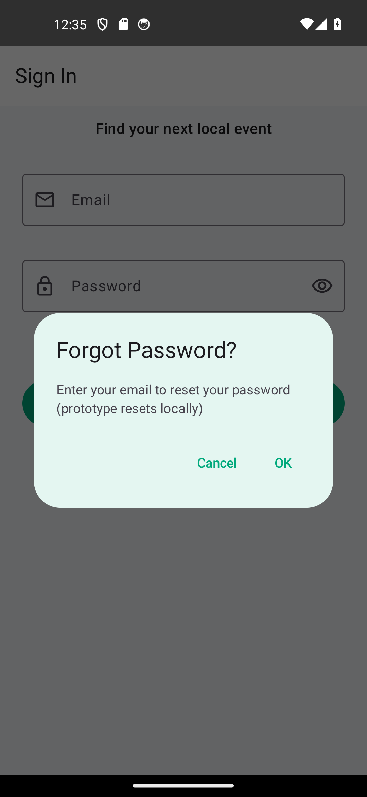 |  |

| Event detail | Map | Favourites | Search |
| :---: | :---: | :---: | :---: |
| 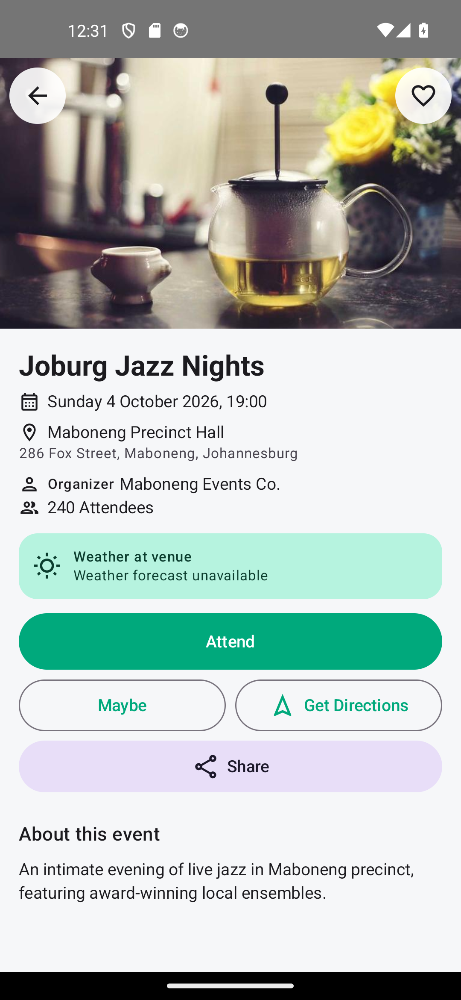 | 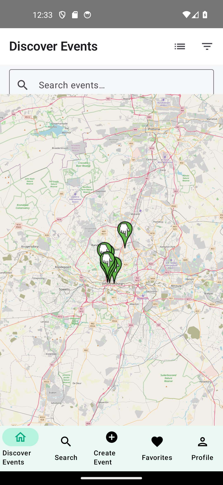 |  |  |

| Create – details | Create – date & venue | Date picker | Create – review |
| :---: | :---: | :---: | :---: |
| 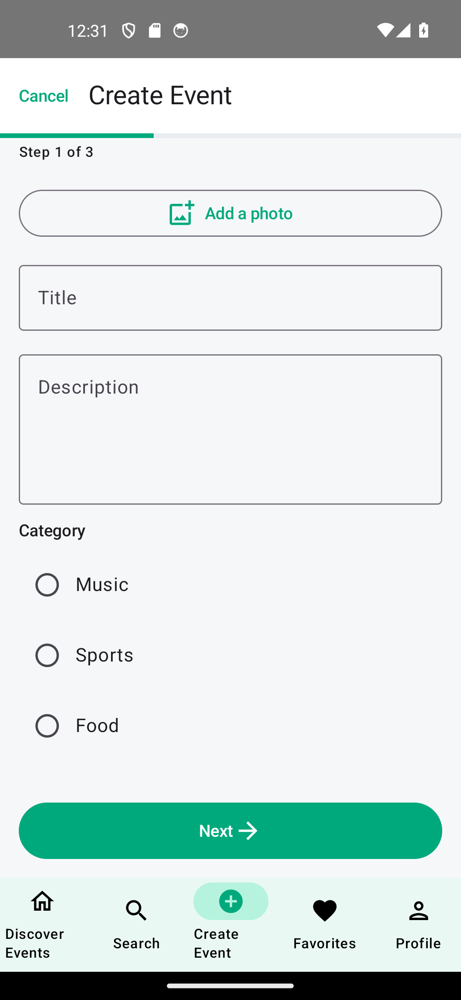 | 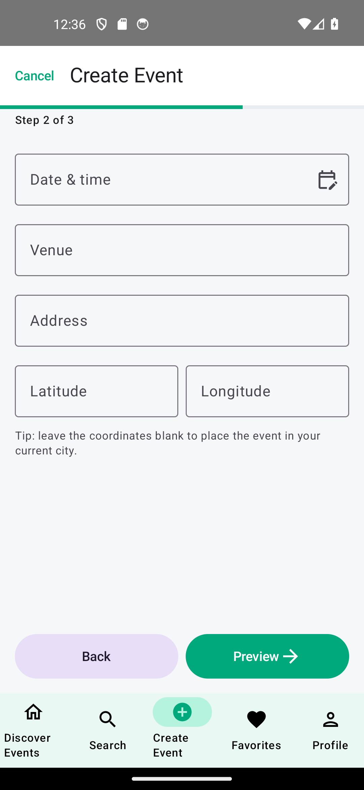 | 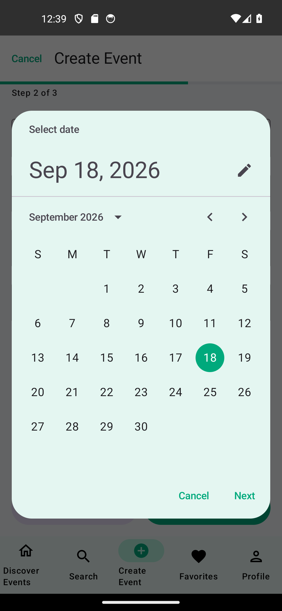 | 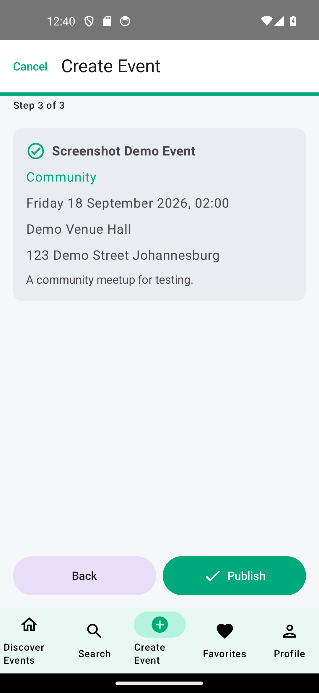 |

| Profile | Edit profile | Settings |
| :---: | :---: | :---: |
| 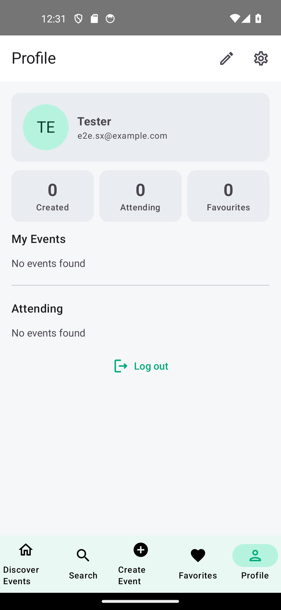 | 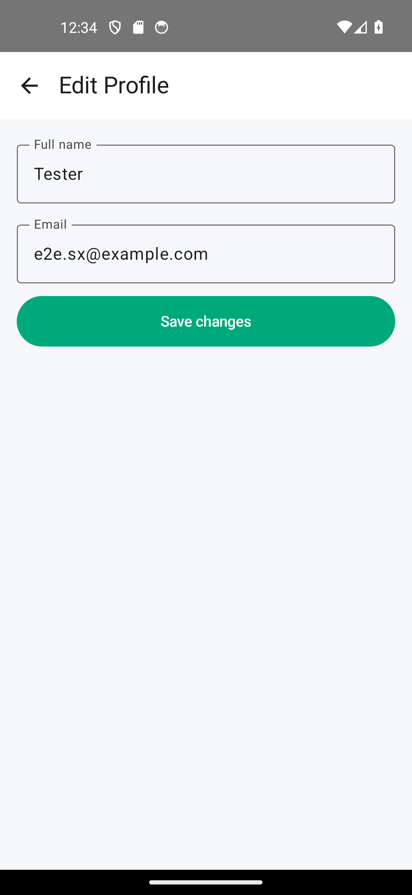 |  |

## Tech stack

| Layer | Choice | Why |
| --- | --- | --- |
| Language | **Kotlin 1.9.22** | First-class Android language, coroutines, null-safety. |
| UI | **Jetpack Compose** (BOM 2024.02, Material 3) | Declarative UI, single activity, no XML layouts. |
| Architecture | **MVVM + Repository** | Testable, unidirectional data flow (`StateFlow`). |
| DI | **Manual `AppContainer`** | Transparent, dependency-free alternative to Hilt for a prototype. |
| Local DB | **Room 2.6.1** | Compile-time verified SQLite for the offline event cache. |
| Preferences | **DataStore Preferences 1.0** | Async, type-safe key/value storage for settings & session. |
| Networking | **Retrofit 2.9 + OkHttp 4.12 + Gson** | Industry standard REST client with logging interceptor. |
| Images | **Coil 2.6** | Coroutine-friendly Compose image loading. |
| Maps | **osmdroid 6.1.18** | Free OpenStreetMap tiles, no API key, no billing. |
| Security SDK | **AndroidX Biometric 1.1** | Fingerprint / face unlock. |
| Build | **AGP 8.2.2, Gradle 8.7, JDK 17** | Current stable toolchain. |
| Tests | **JUnit 4 + kotlinx-coroutines-test** | Pure JVM unit tests, no device required. |

## Architecture

EventFinder follows a clean three-layer **MVVM** architecture. The UI layer never talks to
Retrofit or Room directly — everything flows through repositories that hide the data sources.

### Layered overview

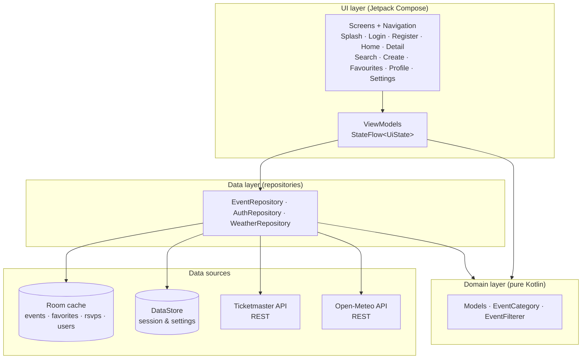

### Event load flow (offline-first)

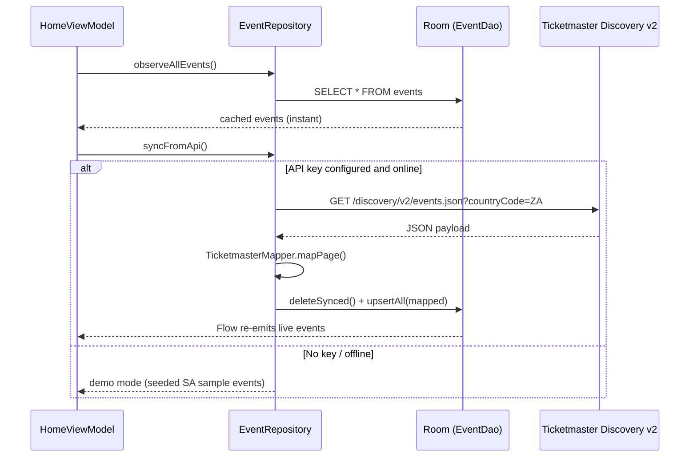

### Navigation graph

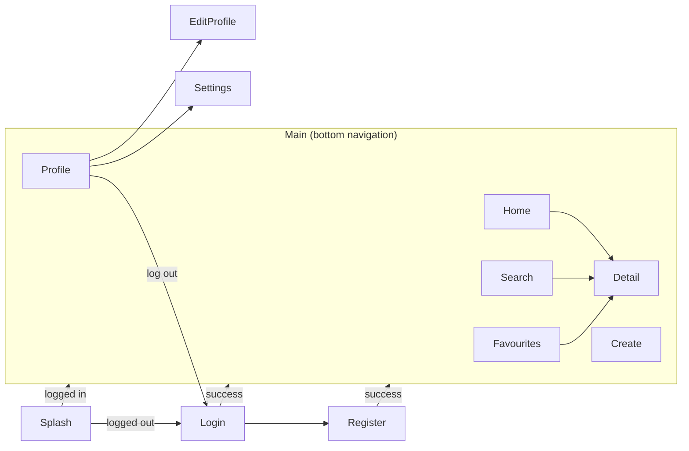

## External APIs

The app deliberately uses **free** services so it can be marked and demonstrated without cost:

| API | Auth | Used for | Docs |
| --- | --- | --- | --- |
| **Ticketmaster Discovery v2** | Free developer key | South African event catalogue (`countryCode=ZA`) | [link](https://developer.ticketmaster.com/products-and-docs/apis/discovery-api/v2/) |
| **Open-Meteo** | Keyless | Weather forecast at the venue on the event day | [link](https://open-meteo.com/en/docs) |
| **OpenStreetMap via osmdroid** | Keyless | Interactive event map | [link](https://github.com/osmdroid/osmdroid) |
| **Picsum Photos** | Keyless | Placeholder imagery | [link](https://picsum.photos/) |

> **Demo mode:** if no Ticketmaster key is configured the app still runs — it seeds the local
> Room cache with a realistic national sample catalogue and clearly logs that sync was skipped.

## Localisation

The whole UI is externalised to string resources and ships in two languages:

- `res/values/strings.xml` — **English**
- `res/values-af/strings.xml` — **Afrikaans**

The language is switched at runtime from **Settings** (persisted in DataStore) and applied
through `LocaleManager` in `MainActivity.attachBaseContext`.

## Offline-first behaviour

- Events, favourites and RSVPs are cached in **Room** and observed as `Flow`s, so the UI renders instantly.
- Favourite and RSVP changes are appended to a **`pending_sync` queue** when the device is offline and can be flushed with `EventRepository.flushPendingActions()`.
- The UI never blocks on the network: a failed sync simply keeps the cached catalogue.

## Security

- Passwords are **never stored in plaintext** — they are salted and hashed with **PBKDF2WithHmacSHA256** (120 000 iterations, 256-bit key) following the OWASP Password Storage Cheat Sheet.
- **Biometric unlock** uses the AndroidX Biometric SDK and degrades gracefully when hardware is unavailable.
- Credentials never leave the device in this prototype. `local.properties`, keystores and other secrets are git-ignored, and the API key is injected through `BuildConfig`.

## Getting started

### Prerequisites

- **Android Studio Hedgehog** (or newer) or the Android command-line tools
- **JDK 17** (`JAVA_HOME` must point at it — AGP 8.x does not support JDK 21)
- Android SDK with **API 34** platform + build-tools
- A physical device or emulator running **API 26+**

### 1. Clone

```bash
git clone https://github.com/Zulfique/eventfinder-south-africa.git
cd eventfinder-south-africa
```

### 2. Configure the SDK path

Create `local.properties` in the project root (git-ignored):

```properties
sdk.dir=C\:\\Users\\<you>\\AppData\\Local\\Android\\Sdk
```

### 3. (Optional) Add the free Ticketmaster key

Get a free key from [developer.ticketmaster.com](https://developer.ticketmaster.com/) and add it to `local.properties`:

```properties
TICKETMASTER_API_KEY=your_free_key_here
```

The key is read from, in order of precedence: the `TICKETMASTER_API_KEY` **environment variable**,
`local.properties`, or a Gradle `-P` property. **Without a key the app runs in demo mode.**

### 4. Build & install

```bash
# Linux / macOS / Git Bash
./gradlew assembleDebug
adb install -r app/build/outputs/apk/debug/app-debug.apk

# Windows (PowerShell)
$env:JAVA_HOME="C:\Program Files\Java\jdk-17"
.\gradlew.bat assembleDebug
adb install -r app\build\outputs\apk\debug\app-debug.apk
```

## Testing

The project has **113 JVM unit tests** across 14 suites, all runnable from the command line with
no emulator:

```bash
./gradlew testDebugUnitTest
```

| Suite | Covers |
| --- | --- |
| `ValidatorsTest` | Email, password strength, name and the multi-field registration form. |
| `PasswordHasherTest` | PBKDF2 hashing, salting, verification and fail-closed behaviour on malformed values. |
| `DistanceCalculatorTest` | Haversine distance, symmetry, rounding and radius checks. |
| `EventFiltererTest` | Keyword / category / radius filtering (including address and description matching), three sort orders, distance attachment. |
| `EventCategoryTest` | Ticketmaster segment ↔ local category mapping in both directions. |
| `TicketmasterMapperTest` | Full payload mapping, malformed-row skipping, coordinate fallback, image selection, date parsing. |
| `WeatherRepositoryTest` | WMO weather-code descriptions and Open-Meteo payload handling. |
| `EventRepositoryTest` | Seeding, sync (network + no-key) including new/updated-favourite alert payloads, favourite/RSVP toggling, event creation, editing/deleting with ownership guard, cache clearing — using in-memory DAO fakes. |
| `SampleEventsProviderTest` | Demo catalogue integrity (unique ids, valid SA coordinates, sane dates). |
| `CreateEventValidationTest` | Per-step wizard validation (required title/description, future date, venue, coordinate ranges) that drives the inline error messages. |
| `EventAlertDetectorTest` | Pure new-event / favourite-changed diffing, including quiet first sync and past-event suppression. |
| `DateTimeUtilsTest` | Relative date helpers (today/tomorrow, day & hour offsets) and stable date formatting. |
| `LoginViewModelTest` | Local password-reset flow (mismatch, unknown email, success) with a fake repository. |

HTML reports are written to `app/build/reports/tests/testDebugUnitTest/index.html`.

### Instrumented UI tests

A small **Compose UI test** suite runs on a connected device/emulator and covers the shared
widgets (`app/src/androidTest/.../ui/components/CommonComponentsTest.kt`):

```bash
./gradlew connectedDebugAndroidTest
```

| Test | Covers |
| --- | --- |
| `eventCard_displaysTitleAndVenue` | Card renders the event title, venue and metadata. |
| `eventCard_clickInvokesCallback` | Tapping the card fires its `onClick`. |
| `eventCard_favouriteToggleInvokesCallback` | The heart button reports add/remove from its content description. |
| `categoryChips_selectsACategoryAndCanClearIt` | Category chips select and clear the filter. |
| `categoryChips_selectsTheActiveChip` | The active category exposes selected semantics; the others do not. |
| `emptyState_displaysTitleAndSubtitle` | The reusable `EmptyState` renders its icon, title and subtitle. |

## Continuous integration

GitHub Actions runs on every push / PR to `main` (`.github/workflows/android-ci.yml`):

1. Validate the Gradle wrapper
2. Set up **JDK 17**
3. `./gradlew testDebugUnitTest`
4. `./gradlew assembleDebug`
5. Upload the test report and the debug APK as build artifacts

CI never depends on a secret to compile — without `TICKETMASTER_API_KEY` the build simply produces
a demo-mode APK.

## Project structure

```
app/src/main/java/com/eventfinder/app/
├── data/
│   ├── local/          Room entities, DAOs, database + entity↔domain mappers
│   ├── remote/         Retrofit services, DTOs, API client, Ticketmaster mapper
│   ├── repository/     Event / Auth / Weather repositories + sample seed data
│   └── store/          DataStore user preferences
├── di/                 AppContainer (manual dependency injection)
├── domain/model/       Event, User, RSVP, categories, filter/sort engine
├── notifications/      Notification channel + reminder receiver
├── security/           Biometric authentication wrapper
├── ui/
│   ├── components/     Shared Compose components + UiMessage
│   ├── navigation/     NavHost + bottom navigation
│   ├── screens/        splash · auth · home · detail · search · create · favorites · profile · editprofile · settings
│   └── theme/           Material 3 colour scheme & typography
└── utils/              Logging, date/time, distance, validation, hashing, locale, network
app/src/test/java/com/eventfinder/app/   JVM unit tests
app/src/androidTest/java/com/eventfinder/app/   Compose instrumented UI tests
docs/screenshots/                        Real device screenshots
```

## Requirement traceability

| Requirement | Where it is implemented |
| --- | --- |
| RESTful API integration | Ticketmaster Discovery v2 (`EventRepository`, `TicketmasterMapper`) and Open-Meteo (`WeatherRepository`) |
| External library integration | Room, Retrofit/OkHttp, DataStore, Coil, osmdroid, AndroidX Biometric |
| Native Android SDK integration | `AlarmManager` + `NotificationManager` reminders, `LocationManager`/location permissions, biometrics |
| Offline-first / robustness | Room cache + `pending_sync` queue, graceful fallbacks, validation on every form |
| Unit testing | 113 JVM tests + 6 Compose instrumented tests + GitHub Actions CI |
| Logging & comments | `AppLogger` used across data/UI layers; KDoc on every class |
| Documentation | This README with Mermaid architecture diagrams |

## Known limitations

The app is a **single-user, offline-first prototype** built entirely on free services, so a few
features that need a shared server are intentionally out of scope:

- **RSVP attendee management** — there is no way to approve or decline other people's attendance
  because accounts and events live only on the device. The RSVP counter and reminder cancellation
  work locally; a real attendee list would need a multi-user backend.
- **Google sign-in** is shown but stubbed, and password reset re-hashes locally instead of sending a
  verification email (that would require a paid mail/SMTP provider).
- **Push notifications** are replaced by on-device sync alerts (`AlarmManager` +
  `NotificationManager`); true push would need Firebase Cloud Messaging.
- **Default city / radius** preferences exist in the data layer but have no settings UI yet.

## Attribution & licences

- Ticketmaster Discovery API — © Ticketmaster, used under the free developer terms.
- Weather data by **Open-Meteo.com** (CC-BY 4.0).
- Map data © **OpenStreetMap** contributors.
- Haversine formula adapted from [Moveable Type Scripts](https://www.movable-type.co.uk/scripts/latlong.html) by Chris Veness.
- Password hashing guidance from the [OWASP Password Storage Cheat Sheet](https://cheatsheetseries.owasp.org/cheatsheets/Password_Storage_Cheat_Sheet.html).
- Placeholder imagery from [Picsum Photos](https://picsum.photos/).
